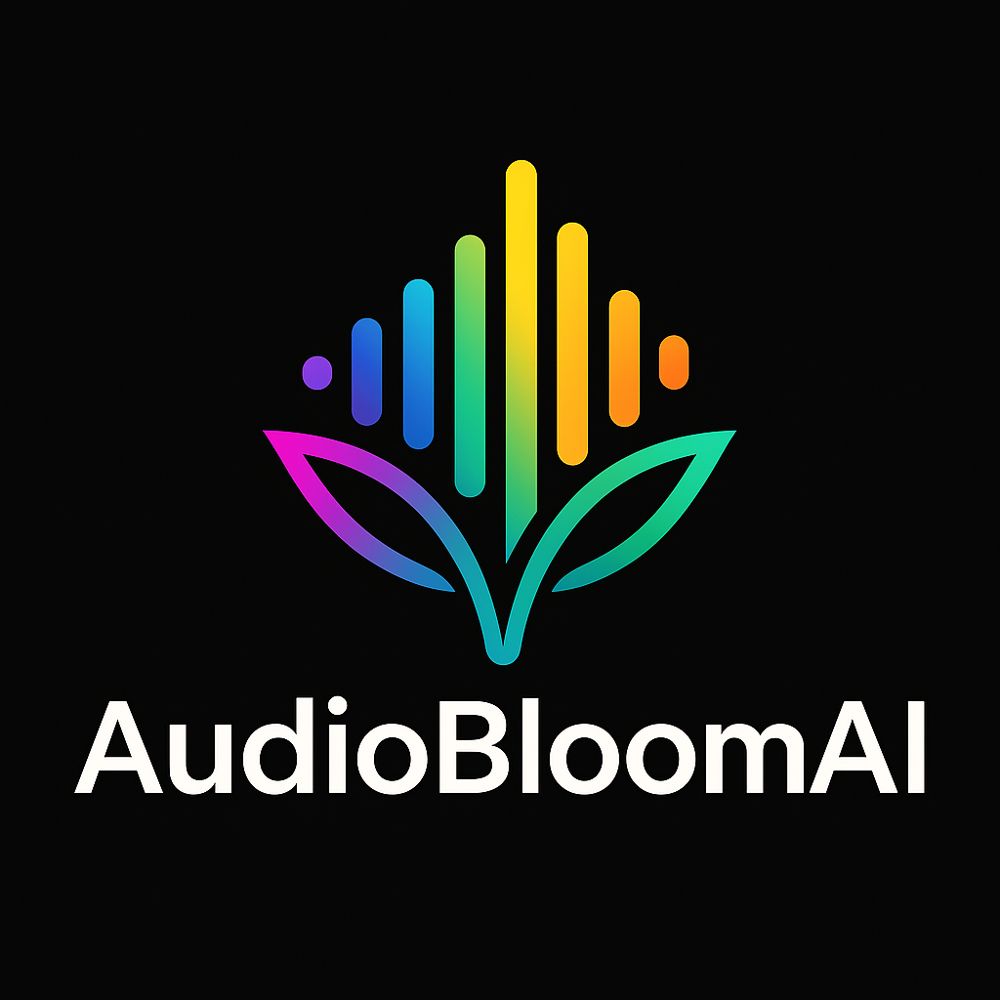

# AudioBloomAI

<p align="center">
  
</p>

<p align="center">
  <b>Next-generation audio visualizer optimized for Apple Silicon M3 Pro, featuring Neural Engine integration and Metal-based graphics pipeline.</b>
</p>

<p align="center">
  <a href="#features">Features</a> •
  <a href="#requirements">Requirements</a> •
  <a href="#installation">Installation</a> •
  <a href="#project-structure">Project Structure</a> •
  <a href="#development-setup">Development Setup</a> •
  <a href="#contributing">Contributing</a> •
  <a href="#license">License</a>
</p>

## Overview

AudioBloomAI is a revolutionary audio visualization experience that reimagines the classic ProjectM/MilkDrop visualizer for the Apple Silicon era. By leveraging the Neural Engine and Metal framework, AudioBloomAI delivers stunning real-time visualizations with unprecedented performance and energy efficiency on modern Mac hardware.

The project combines advanced audio analysis algorithms with machine learning to create responsive, dynamic visual patterns that genuinely reflect the musical structure and emotional content of any audio source.

## Features

- **Neural Engine Integration**: Utilizes Apple's Neural Engine to detect musical patterns, beats, and emotional content in real-time
- **Metal-Optimized Renderer**: Custom Metal graphics pipeline designed specifically for Apple Silicon
- **Adaptive Visualization**: Visualizations evolve and respond to the music's characteristics
- **Modern SwiftUI Interface**: Clean, intuitive user experience built with SwiftUI
- **Audio Capture from Multiple Sources**: Process system audio, microphone input, or audio files
- **Preset System**: Create, save, and share your unique visualization styles
- **Low Power Consumption**: Optimized for efficiency on Apple Silicon
- **High Frame Rate Rendering**: Smooth 120fps+ on supported displays

## Requirements

- **macOS 15+** (Sequoia)
- **Apple Silicon** Mac (optimized for M3 Pro, but compatible with all Apple Silicon Macs)
- **Xcode 16+** (for development)

While AudioBloomAI is designed to run on any Apple Silicon Mac, it's specifically optimized for the M3 Pro and later chips to take full advantage of their Neural Engine capabilities.

## Installation

### Using Pre-built Binary

1. Download the latest release from the [Releases](https://github.com/noktirnal42/AudioBloomAI/releases) page
2. Drag AudioBloomAI to your Applications folder
3. Launch the application and grant any required permissions (microphone access, etc.)

### Building from Source

1. Clone the repository
   ```bash
   git clone https://github.com/noktirnal42/AudioBloomAI.git
   cd AudioBloomAI
   ```

2. Open the project in Xcode
   ```bash
   xed .
   ```

3. Build and run the application (⌘R)

## Project Structure

The project follows a modular architecture to keep components decoupled and maintainable:

```
AudioBloomAI/
├── Sources/
│   ├── App/                    # Main application code
│   ├── AudioEngine/            # Audio capture and analysis
│   ├── MetalRenderer/          # Metal rendering pipeline
│   ├── NeuralProcessor/        # Neural Engine integration
│   ├── Visualization/          # Visualization algorithms
│   ├── Presets/                # Built-in and user presets
│   └── Utils/                  # Utility functions and extensions
├── Resources/                  # Images, shader files, etc.
├── Tests/                      # Unit and integration tests
├── Examples/                   # Example implementations
└── Documentation/              # Project documentation
```

## Development Setup

### Prerequisites

- Xcode 16 or later
- macOS 15+ SDK
- [SwiftLint](https://github.com/realm/SwiftLint) (optional, for code style enforcement)

### Getting Started

1. Install Swift packages:
   ```bash
   swift package resolve
   ```

2. Set up development certificates (if deploying to App Store):
   - Open Xcode project settings
   - Configure your Apple Developer account
   - Update signing certificates

3. Configure build schemes:
   - The `Debug` scheme includes additional debugging visualizations
   - The `Release` scheme is optimized for performance

### Testing

Run the test suite using Xcode's testing interface (⌘U) or via the command line:

```bash
swift test
```

## Contributing

Contributions are welcome! Please feel free to submit a Pull Request.

1. Fork the repository
2. Create your feature branch (`git checkout -b feature/amazing-feature`)
3. Commit your changes (`git commit -m 'Add some amazing feature'`)
4. Push to the branch (`git push origin feature/amazing-feature`)
5. Open a Pull Request

Please make sure your code adheres to our style guidelines and passes all tests.

### Code Style

- Follow Swift API Design Guidelines
- Use SwiftLint for code style enforcement
- Write documentation comments for all public APIs
- Include unit tests for new features

## License

This project is licensed under the MIT License - see the [LICENSE](LICENSE) file for details.

## Acknowledgments

- Inspired by the classic [ProjectM](https://github.com/projectM-visualizer/projectm) and MilkDrop visualizers
- Built with [Swift Algorithms](https://github.com/apple/swift-algorithms) and [Swift Numerics](https://github.com/apple/swift-numerics)
- Special thanks to the Apple Developer community for their valuable resources on Metal optimization

---

<p align="center">
  Made with ❤️ by <a href="https://github.com/noktirnal42">noktirnal42</a>
</p>

